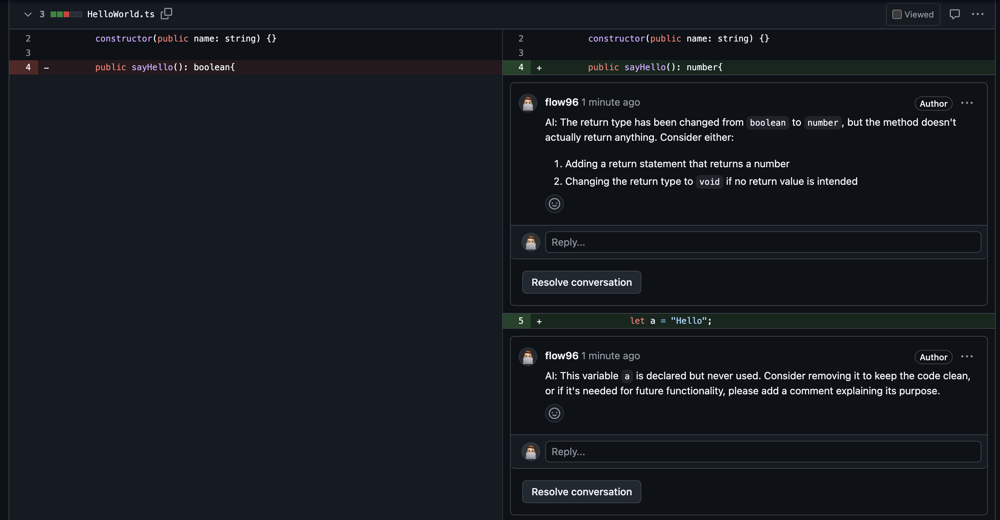

# PR Review MCP Server

> This MCP does **not** require any Open AI keys.
> You can use it for free within Claude Desktop or the Cursor IDE.

A Model Context Protocol (MCP) server that provides tools for automated PR reviews. This server enables LLMs to:

1. **Get PR Diffs**: Retrieve file diffs and metadata for a specific pull request
2. **Add PR Comments**: Add review comments to specific files and lines in a pull request

Let AI do a quick first code review.

## Setup

### 1. Download a release and extract the files

Place the files for example at
`~/Documents/MCPServers/PrReviewer`

### 2. Create a GitHub API Token

You'll need a GitHub Personal Access Token with the following permissions:
- `pull_requests:write` (to add comments)

Create a token at: https://github.com/settings/personal-access-tokens/

The token will be configured in your MCP client configuration (see below).

### 3. Add the MCP server configuration

Add this server to your MCP client configuration. For Cursor or Claude, add to your MCP settings:

```json
{
  "mcpServers": {
    "pr-review": {
      "command": "node",
      "args": ["<PATH/TO/THE/DOWNLOADED/RELEASE>/index.cjs"],
      "env": {
        "GITHUB_TOKEN": "ghp_your_github_personal_access_token_here",
        "GITHUB_API_URL": "https://api.github.com",
        "COMMENT_PREFIX": ""
      }
    }
  }
}
```
```yaml
mcpServers:
  pr-review:
    command: node
    args:
      - <PATH/TO/THE/DOWNLOADED/RELEASE>/index.cjs
    env:
      GITHUB_TOKEN: ghp_your_github_personal_access_token_here
      GITHUB_API_URL: https://api.github.com
      COMMENT_PREFIX: ""
```


**Important**: Replace `ghp_your_github_personal_access_token_here` with your actual GitHub personal access token.<br />
Replace `<PATH/TO/THE/DOWNLOADED/RELEASE>` with the actual path of the downloaded release and point it to the `index.cjs` file.


## How to use it

After the setup simply ask the AI to review a specific PR like so:

```bash
Please add a review to the PR: <LINK_TO_THE_PR>
```

Example usage:


The comments in the PR:



## Available Tools

### 1. get_pr_diff

Retrieves the complete diff information for a pull request.

### 2. add_pr_comment

Adds a review comment to a specific file and line in a pull request.


## Security Notes

- Never commit GitHub tokens to version control
- The token is securely passed via environment variables in the MCP configuration
- Tokens should have minimal required permissions
- The token is only accessible to the MCP server process and not exposed to the LLM
